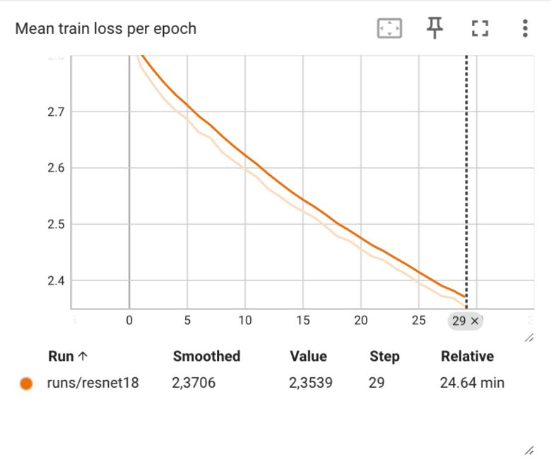
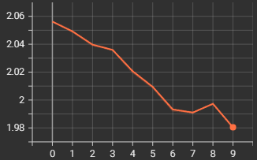
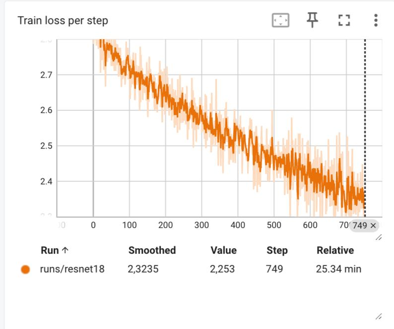

~~# Action Recognition

Команда 7: Никита Хозин, Антон Володин, Мульхам Шахин

# 1. Обучение модели на отдельных кадрах

## 1.1. Подготовка данных

В папке utils находится несколько скриптов для сбора и обработки данных:

- `kinetics_downloader.py` - скачивает видео с ютуба (
  из [репо](https://github.com/SashaMogilevskii/hw5_action_recognition/blob/master/scripts/utils.py))
- `parrallel_download.py` - позволяет запускать первый скрипт в несколько потоков
- `clip_videos.py` - заметили проблему с параллелизмом ffmpeg, поэтому сделали отдельный скрипт для обрезки видео.

Много видео были недоступны, из-за этого датасет уменьшился до ~2200 видео.

## 1.2. Обучение модели

Для обучения на отдельных кадрах, была выбрана модель ResNet18. В нотбуке `kinetics_frames_experements.ipynb`
описан процесс обучения модели.

Результаты на валидации:

- Accuracy на валидации: 0.06884
- F1 на валидации: 0.06462
- Min loss: 1.98

В ноутбуке `resnet18_validation_frames.ipynb` можно посмотреть визуализацию предсказаний модели на валидации.

### Mean train loss per epoch
- Первый график — график обучения на удаленной машине (30 эпох)
- Второй график — график обучения на коллабе (последние 10 эпох)

### Train loss per step 

# 2. Обучение модели на keypoint'ах

## 2.1. Подготовка данных

- `create_keypoints_dataset.py` - создает датасет с keypoint'ами, для этого используется класс `PoseEstimationDataset`
  из `preprocessing/pose_estimation.py`.
  В рамках процессе предобработки, также детектируется центральный человек, и для него только сохраняются keypoint'ы,
  поскольку невсегда все люди на кадрах танцуют, и этот факт может создать шум в данных.

## 2.2. Обучение модели

Для обучения на последовательности keypoint'ов, была выбрана модель LSTM. В
нотбуке `kinetics_keypoints_experements.ipynb` описан процесс обучения модели.

Результаты:
- test accuracy 0.2053
- loss:
   
